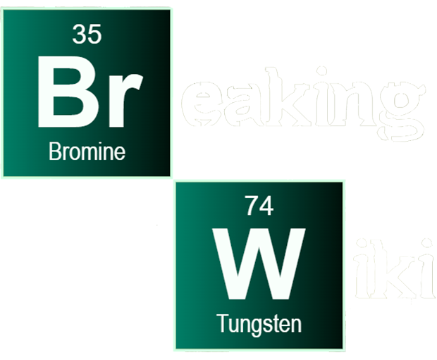

  

 

# 💀  Breaking Wiki 💀

### Wiki con la tematica de la serie televisiva "Breaking Bad".

### Desarrollada con la api "Breaking Bad API": https://breakingbadapi.com

 

## Integrantes del proyecto: 

<table>
  <tbody>
    <tr>
      <td align="center">
        <a href="https://github.com/Martinperez21">
         
        
        <b>PEREZ MARTIN</b>
        
        </a>
      </td>
      <td align="center">
        <a href="https://github.com/scott1ee">
         
        
        <b>HERRERA FRANCO</b>
        
        </a>
      </td>
    </tr>
  </tbody>
</table>